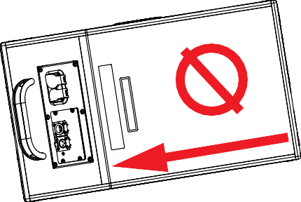
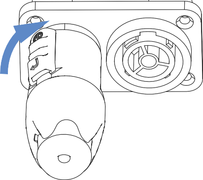
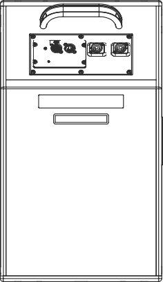

# USW-112P Loudspeaker Operation

{:width="200px"}

{:width=70%} [**Keep these important operating instructions.**](https://meyersound.com/) [**Check**](https://meyersound.com/) **meyersound.com for updates.**

# IMPORTANT SAFETY INSTRUCTIONS

These symbols indicate important safety or operating features in this booklet and on the frame or chassis:

## SYMBOLS USED

|                                                                 | ❙                                                                     |                             |                                  |                                      |                                                                                                                       |
|-----------------------------------------------------------------|-----------------------------------------------------------------------|-----------------------------|----------------------------------|--------------------------------------|-----------------------------------------------------------------------------------------------------------------------|
| **Dangerous voltages: risk of electric shock**                  | **Important operating instructions**                                  | **Replaceable Fuse**        | **Protective earth ground**      | **Hot surface: do not touch**        | **Electronic instructions for use: instruction location in QR code**   |
| **Gefährliche Spannungen: Stromschlaggefahr**                   | **Hinweis auf wichtige Punkte der Betriebsanleitung**                 | **Austauschbare Sicherung** | **Schutzerde**                   | **Heiße Oberfläche: nicht berühren** | **Elektronische Gebrauchsanweisung: anweisungsort im QR-Code**                                                        |
| **Pour indiquer les risques résultant de tensions dangereuses** | **Instructions d'utilisation importantes**                            | **Fusible remplaçable**     | **Terre de protection**          | **Surface chaude: ne pas toucher**   | **Mode d'emploi électronique: emplacement des instructions dans le code QR**                                          |
| **Para indicar voltajes peligrosos**                            | **Instrucciones importantes** **de funcionamiento y/o Mantenimiento** | **Fusible reemplazable**    | **Toma de tierra de protección** | **Superficie caliente: no tocar**    | **Instrucciones de uso electrónicas: ubicación de instrucciones en el código QR**                                     |

1.  Read these instructions.
2.  Keep these instructions.
3.  Heed all warnings.
4.  Follow all instructions.
5.  Do not use this apparatus near water.
6.  Clean only with dry cloth.
7.  Do not block any ventilation openings. Install in accor- dance with Meyer Sound's installation instructions.
8.  Do not install near any heat sources such as radiators, heat registers, stoves, or other apparatus that produce heat.
9.  Do not defeat the safety purpose of the grounding-type plug. A grounding type plug has two blades and a third grounding prong. The third prong is provided for your safety. If the provided plug does not fit into your outlet, consult an electrician for replacement of the obsolete outlet.
10. Protect the power cord from being walked on or pinched, particularly at plugs, convenience receptacles, and the point where they exit from the apparatus. The AC mains plug or appliance coupler shall remain readily accessible for operation.
11. Only use attachments/accessories specified by Meyer Sound.
12. Use only with the caster rails or rigging specified by Meyer Sound, or sold with the apparatus. Handles are for carrying only.
13. Unplug this apparatus during lightning storms or when unused for long periods of time.
14. If equipped with an external fuse holder, the replaceable fuse is the only user-serviceable item. When replacing the fuse, only use the same type and the same value.
15. Refer all other servicing to qualified service personnel. Servicing is required when the apparatus has been dam- aged in any way, such as when the power-supply cord or plug has been damaged; liquid has been spilled or objects have fallen into the apparatus; rain or moisture has entered the apparatus; the apparatus has been dropped; or when for undetermined reasons the appara- tus does not operate normally.

>   ❙

>   require installation by an Instructed person or the use of ready- made leads or cords.

>   ❙

>   humid locations without using weather protection equip- ment from Meyer Sound.

>   ❙

>   ❙

### English

-   To reduce the risk of electric shock, disconnect the apparatus from the AC mains before installing audio cable. Reconnect the power cord only after making all signal connections.
-   Connect the apparatus to a two-pole, three-wire grounding mains receptacle. The receptacle must be connected to a fuse or circuit breaker. Connection to any other type of receptacle poses a shock hazard and may violate local electrical codes.
-   Do not install the apparatus in wet or humid locations without using weather protection equipment from Meyer Sound.
-   Do not allow water or any foreign object to get inside the apparatus. Do not put objects containing liquid on or near the unit.
-   To reduce the risk of overheating the apparatus, avoid exposing it to direct sunlight. Do not install the unit near heat-emitting appliances, such as a room heater or stove.
-   If equipped with an external fuse holder, the replaceable fuse is the only item that can be serviced by the user. When replacing the fuse, only use the same type and value.
-   This apparatus contains potentially hazardous voltages. Do not attempt to disassemble the unit. The only user- serviceable part is the fuse. All other repairs should be performed only by factory-trained service personnel.

###   
Deutsch

-   Zur Minimierung der Gefahr eines elektrischen Schlages trennen Sie das Produkt vor dem Anschluss von Audio-und/ oder Steuerleitungen vom Stromnetz. Das Netzkabel darf erst nach Herstellung aller Signalverbindungen wieder eingesteckt werden.
-   Das Produkt an eine vorschriftsgemäss installierte dreipolige Netzsteckdose (Phase, Neutralleiter, Schutzleiter) anschließen. Die Steckdose muss vorschriftsgemäß mit einer Sicherung oder einem Leitungsschutzschalter abgesichert sein. Das Anschließen des Produkts an eine anders ausgeführte Stromversorgung kann gegen Vorschriften verstossen und zu Stromunfällen führen.
-   Das Produkt nicht an einem Ort aufstellen, an dem es direkter Wassereinwirkung oder übermäßig hoher Luftfeuchtigkeit ausgesetzt werden könnte, solange es sich nicht um ein Produkt handelt, dass mit der Meyer Sound Weather Protection Option ausgestattet ist.
-   Vermeiden Sie das Eindringen von Wasser oder Fremdkörpern in das Innere des Produkts. Stellen Sie keine Objekte, die Flüssigkeit enthalten, auf oder neben dem Produkt ab.
-   Um ein Überhitzen des Produkts zu verhindern, halten Sie das Gerät von direkter Sonneneinstrahlung fern und stellen Sie es nicht in der Nähe von wärmeabstrahlenden Geräten (z.B. Heizgerät oder Herd) auf.
-   Bei Ausstattung mit einem externen Sicherungshalter ist die austauschbare Sicherung das einzige Gerät, das vom Benutzer gewartet werden kann. Verwenden Sie beim Austausch der Sicherung nur den gleichen Typ und Wert.
-   Dieses Gerät enthält möglicherweise gefährliche Spannungen. Versuchen Sie nicht, das Gerät zu zerlegen. Der einzige vom Benutzer zu wartende Teil ist die Sicherung. Alle anderen Reparaturen dürfen nur von im Werk geschultem Servicepersonal ausgeführt werden.

*IMPORTANT SAFETY INSTRUCTIONS*

### Français

-   Pour éviter tout risque d’électrocution, débranchez l’enceinte de la prise secteur avant de mettre en place le câble audio.Ne rebranchez le cordon secteur qu’après avoir procédé à toutes les connexions de signal audio.
    -   Brancher l'appareil sur une prise secteur à trois fils et deux pôles avec mise à la terre. La prise doit être reliée à un fusible ou à un disjoncteur. Le branchement à tout autre type de prise présente un risque de choc électrique et peut enfreindre les codes locaux de l'électricité.
    -   N’installez pas l’enceinte dans des endroits humides ou en présence d’eau sans utiliser d’équipements de protection adéquats fournis par Meyer Sound.
    -   Ne laissez pas d’eau ou d’objet étranger, quel qu’il soit, pénétrer à l’intérieur de l’enceinte. Ne posez pas d’objet contenant du liquide sur ou à proximité de l’enceinte.
    -   Pour réduire les risques de surchauffe, évitez d’exposer directement l’enceinte aux rayons du soleil. Ne l’installez pas à proximité de sources de chaleur, radiateur ou four par exemple.
    -   S'il est équipé d'un porte-fusible externe, le fusible remplaçable est le seul élément qui peut être réparé par l'utilisateur. Lors du remplacement du fusible, n'utilisez que le même type et la même valeur.
    -   Cet appareil contient des tensions potentiellement dangereuses. N'essayez pas de démonter l'appareil.Le fusible est la seule pièce réparable par l'utilisateur. Toutes les autres réparations doivent être effectuées uniquement par du personnel de maintenance formé en usine.

###   
Español

-   Para reducir el riesgo de descarga eléctrica, desconecte el aparato de la red eléctrica antes de instalar el cable de audio. Vuelva a conectar el cable de alimentación sólo después de realizar todas las conexiones de señal.
-   Conecte el aparato a una toma de corriente de tres hilos y dos polos con conexión a tierra. El receptáculo debe estar conectado a un fusible o disyuntor. La conexión a cualquier otro tipo de receptáculo representa un riesgo de descarga eléctrica y puede violar los códigos eléctricos locales.
-   No instale el aparato en lugares húmedos o mojados sin usar el equipo de protección contra intemperie de Meyer Sound.
-   No permita que penetre agua u otros objetos extraños en el interior del aparato. No coloque objetos que contengan líquido sobre o cerca de la unidad.
-   Para reducir el riesgo de sobrecalentamiento del aparato, evite exponerlo a la luz solar directa. No instale la unidad cerca de aparatos que emitan calor, como un calefactor o una estufa.
-   Si está equipado con un portafusibles externo, el fusible reemplazable es el único elemento que puede ser reparado por el usuario. Cuando reemplace el fusible, use solamente el mismo tipo y valor.
-   Este aparato contiene voltajes potencialmente peligrosos. No intente desmontar la unidad. La única pieza que el usuario puede reparar es el fusible. Todas las demás reparaciones deben ser realizadas únicamente por personal de servicio capacitado de fábrica.

| **Important Safety Instructions**                                                 | [**iii**](#_bookmark0) |
|-----------------------------------------------------------------------------------|------------------------|
| [Symbols Used](#_bookmark1)                                                       | [iii](#_bookmark1)     |
| [**Introduction**](#_bookmark2)                                                   | [**1**](#_bookmark2)   |
| [How to Use This Manual](#_bookmark3)                                             | [1](#_bookmark3)       |
| [The USW-112P Loudspeaker](#_bookmark4)                                           | [1](#_bookmark4)       |
| [**Power Requirements**](#_bookmark5)                                             | [**5**](#_bookmark5)   |
| [AC Power Distribution](#_bookmark6)                                              | [5](#_bookmark6)       |
| [AC Connectors](#_bookmark10)                                                     | [6](#_bookmark10)      |
| [Wiring AC Power Cables](#_bookmark17)                                            | [7](#_bookmark17)      |
| [Voltage Requirements](#_bookmark18)                                              | [8](#_bookmark18)      |
| [Current Requirements](#_bookmark19)                                              | [8](#_bookmark19)      |
| [Intelligent AC Power Supply](#_bookmark21)                                       | [8](#_bookmark21)      |
| [Electrical Safety Guidelines](#_bookmark22)                                      | [9](#_bookmark22)      |
| [**Amplification and Audio Connectors**](#_bookmark23)                            | [**11**](#_bookmark23) |
| [TruPower Limiting](#_bookmark24)                                                 | [11](#_bookmark24)     |
| [USW-112P Analog Version User Panel](#_bookmark25)                                | [11](#_bookmark25)     |
| [USW-112P Digital Version User Panel](#_bookmark34)                               | [14](#_bookmark34)     |
| [Connecting to the USW-112P Digital Version](#_bookmark36)                        | [16](#_bookmark36)     |
| [Amplifier Cooling System](#_bookmark37)                                          | [16](#_bookmark37)     |
| [**QuickFly Rigging**](#_bookmark38)                                              | [**17**](#_bookmark38) |
| [USW-112P Rigging Optional Accessories](#_bookmark39)                             | [17](#_bookmark39)     |
| [Rigging Points](#_bookmark41)                                                    | [18](#_bookmark41)     |
| [MUB-USW-112 U-Bracket](#_bookmark42)                                             | [18](#_bookmark42)     |
| [Using the USW-112P Pole Mount](#_bookmark45)                                     | [20](#_bookmark45)     |
| [**RMS Remote Monitoring System**](#_bookmark46)                                  | [**21**](#_bookmark46) |
| [Monitoring the USW-112P Digital Loudspeaker (Optional RMS Module)](#_bookmark47) | [21](#_bookmark47)     |
| [Monitoring The USW-112P Digital Loudspeaker](#_bookmark49)                       | [21](#_bookmark49)     |
| [Compass RMS Software](#_bookmark50)                                              | [21](#_bookmark50)     |
| [RMS Module Analog Version](#_bookmark52)                                         | [22](#_bookmark52)     |
| [RMS Module Neuron ID (Analog Model)](#_bookmark54)                               | [22](#_bookmark54)     |
| [USW-112P Digital Wink Function](#_bookmark55)                                    | [22](#_bookmark55)     |
| [**System Design and Integration Tools**](#_bookmark56)                           | [**23**](#_bookmark56) |
| [MAPP System Design Tool](#_bookmark57)                                           | [23](#_bookmark57)     |
| [Galileo GALAXY Network Platform](#_bookmark58)                                   | [24](#_bookmark58)     |
| [**Meyer Sound Weather Protection**](#_bookmark59)                                | [**25**](#_bookmark59) |
| [Weather Protection Components](#_bookmark61)                                     | [26](#_bookmark61)     |
| [Installation Practices](#_bookmark62)                                            | [26](#_bookmark62)     |
| [IP Ratings](#_bookmark63)                                                        | [27](#_bookmark63)     |

>   [Weather-Protected USW-112P Installation	29](#_TOC_250000)

>   [Permissible Orientations	29](#_bookmark67)

>   [PowerCON TRUE1 TOP Connection	30](#_bookmark71)

>   [USW-112P Specifications	33](#_bookmark76)

>   [USW-112P Acoustical, Electrical, and Physical Specifications	33](#_bookmark78)

>   [USW-112P Loudspeaker Dimensions	36](#_bookmark79)

>   [MUB-USW-112P Dimensions	37](#_bookmark80)

## HOW TO USE THIS MANUAL

Please read these instructions in their entirety before configuring a Meyer Sound loudspeaker system. In particular, pay close attention to material related to safety issues.

As you read these instructions, you will encounter the following icons for notes, tips, and cautions:

៧

࢓

❙

>   cause delays or other problems.

>   Information and specifications are subject to change. Updates and supplementary information are available at:

-   [meyersound.com/products](https://meyersound.com/products)
-   [meyersound.com/documents](https://meyersound.com/documents).

    Meyer Sound Technical Support is available at:

    • +1 510 486.1166

    (Monday through Friday 9:00 am to 5:00 pm PST)

    • +1 510 486.0657

    (after hours support)

-   [meyersound.com/support](https://meyersound.com/support).

## THE USW-112P LOUDSPEAKER

The USW-112P compact narrow subwoofer provides big bass sound for very tight spaces. Its compact rectangular enclosure and slanted connector panel enable flush- mounting of the cabinet against wall surfaces, reducing required installation depth to 12 inches, including connectors.

Designed to be the ideal companion to Meyer Sound’s ULTRA-X20, it also complements the low frequencies in other Meyer Sound loudspeakers, such as the UP-4slim and those in the UPM family.

The USW-112P has an operating frequency range of 35–140 Hz with a linear peak SPL of 123 dB. The bass reflex cabinet employs a low-velocity port design for high efficiency and low port distortion.

*USW-112P with Front Grille Removed*

The cabinet houses a Class D power amplifier with signal processing including correction filters for phase and frequency response, and driver protection circuitry.

The amplifier/processing package incorporates Meyer Sound’s Intelligent AC™, which auto-selects the correct operating voltage, suppresses high voltage transients, filters EMI and provides soft-start power-up. Audio connectors are XLR (analog version) or etherCON (Milan™ Certified digital version) , and power input and looping output connectors are PowerCON 20 (analog version) or PowerCON TRUE1 TOP (digital and weather-protected models).

*USW-112P Rear View (Analog Version)*

[The USW-112XP version with IntelligentDC technology suits applications where AC power distribution is a limiting factor. It receives DC power and balanced audio from a](https://meyersound.com/documents)

[Meyer Sound power supply over a single composite cable.](https://meyersound.com/documents) [(See](https://meyersound.com/documents) meyersound.com/documents for the USW-112XP datasheet and operating instructions.)

Remote monitoring is possible on the analog version via the optional RMS remote monitoring system module, which in conjunction with the optional RMServer™ hardware unit, provides comprehensive monitoring of loudspeaker parameters from a host computer running Compass® Control Software. The digital version provides integrated monitoring via Compass Control Software.

Meyer Sound builds the USW-112P cabinet from premium birch plywood coated with a durable black-textured finish and includes a powder-coated, round-perforated steel grille to protect the drivers. Weather protection and custom color finishes for specific cosmetic requirements are available options.

With its versatile shape, the USW-112P can be placed on the ground in a horizontal or vertical position to accommodate installation requirements.

*USW-112P with MUB-USW-112P in Horizontal Position*

The USW-112P comes standard with M8 mounting points at the top and bottom for use with the optional U-bracket that enables wall, ceiling, or truss mounting. It also features an integral 35 mm pole mount receptacle with M20 threads for added stability.

*USW-112P with MUB-USW-112P in Ceiling Mount Position*

*INTRODUCTION*

*USW-112P with MUB-USW-112P in Vertical Wall Mount Position*

*USW-112P with Eye Bolt*

*ULTRA-X20 Pole Mounted on the USW-112P using the MPK-POLE and a PAS-M8 Adapter Sleeve*

# POWER REQUIREMENTS

>   The USW-112P loudspeaker combines advanced loudspeaker technology with equally advanced power capabilities. Understanding power distribution, voltage and current requirements, and electrical safety guidelines is critical for the safe operation of the USW-112P.

## AC POWER DISTRIBUTION

>   All components in an audio system (self-powered loudspeakers, mixing consoles, and processors) must be properly connected to an AC power distribution system, ensuring that AC line polarity is preserved and that all grounding points are connected to a single node or common point using the same cable gauge (or larger) as the neutral and line cables.

>   ❙

>   250 V AC (typically 120 V AC from line to ground).

>   ❙

>   between the neutral and earth-ground lines is less than 5 V AC when using single-phase AC wiring.

>   ៧

>   serious damage to the input and output stages of the system’s electronic components.

### 120 V AC, 3-Phase Wye System (Single Line)

#### Line-Neutral-Earth/Ground

[Figure 1](#_bookmark7) illustrates a basic 120 V AC, 3-phase Wye distribution system with the loudspeaker load distributed across all three phases, with each loudspeaker connected

>   to a single line and common neutral and earth/ground lines. This system delivers 120 V AC to each loudspeaker.

>   Loudspeaker

>   (120 V AC)

>   Loudspeaker

>   (120 V AC)

>   Loudspeaker

>   (120 V AC)

>   Line 2 (120 V AC)

>   Line 3 (120 V AC)

>   Neutral Earth/Ground

>   *Figure 1: 120 V AC, 3-Phase Wye System (Single Line to Loudspeakers)*

### 120 V AC, 3-Phase Wye System (Two Lines)

#### Line-Line-Earth/Ground

>   Loudspeaker

>   (208 V AC)

>   Loudspeaker

>   (208 V AC)

>   Loudspeaker

>   (208 V AC)

>   Line 1 (120 V AC)

>   Line 2 (120 V AC)

>   Line 3 (120 V AC)

>   Neutral Earth/Ground

>   *Figure 2: 120 V AC, 3-Phase Wye System (Two Lines to Loudspeakers)*

>   ࢓

>   single-line systems, thereby reducing voltage drop due to cable resistance. It also excludes the potential of varying ground to neutral voltages producing an audible hum.

### 230 V AC, 3-Phase Wye System (Single Line)

#### Line-Neutral-Earth/Ground

[Figure 3](#_bookmark9) illustrates a basic 230 V AC, 3-phase Wye distribution system with the loudspeaker load distributed across all three phases, with each loudspeaker connected

Loudspeaker

(230 V AC)

Loudspeaker

(230 V AC)

Loudspeaker

(230 V AC)

Line 1 (230 V AC)

Line 2 (230 V AC)

Line 3 (230 V AC)

Neutral Earth/Ground

*Figure 3: 230 V AC, 3-Phase Wye System (Single Line to Loudspeakers)*

❙

would exceed the upper voltage limit (275 V AC) and will damage the loudspeaker.

## AC CONNECTORS

The USW-112P user panel includes two powerCON 20 connectors ([Figure 4](#_bookmark11)), one for AC Input (blue) and one for AC Loop Output (gray).

*Figure 4: AC Input (Left) and AC Loop Output (Right) Connectors*

The weather-protected and digital versions use the robust PowerCON TRUE1 TOP chassis connector (F[igure 5](#_bookmark12)).

❙

True1 TOP cable connectors or with the sealing cap in place when the chassis connectors are not in use.

**CAUTION:** Ensure the rubber sealing cover is in place when either connector (input or loop) is not in use.

*Figure 5: PowerCON TRUE1 TOP Connector Panel (Covers Open)*

### ❙

The blue AC Input connector supplies power to

USW-112P. The 3-conductor powerCON 20 is rated at 20 A and uses a locking connector that prevents accidental disconnections. A 10-foot AC power cable, rated at 15 A, is included with each loudspeaker. If the included AC power cable is replaced, make sure to use a cable with the appropriate power plug (on the other end) for the region where the unit will be operated. USW-112P requires a grounded outlet. To operate safely and effectively, it is extremely important that the entire system be properly grounded.

The AC Input connector also supplies power to any additional loudspeakers connected to the loudspeaker’s gray Loop Output connector.

❙

capability of the AC Input connector (20 A) or the included AC power cable (15 A). Consider the total current draw for all loudspeakers on the circuit, including the first loudspeaker ([Table 1](#_bookmark14)).

### AC Loop Output (Gray)

The gray AC Loop Output connector allows multiple

USW-112P to be looped and powered from a single power source. The 3-conductor powerCON 20 is rated at 20 A and uses a locking connector that prevents accidental disconnections. For applications that require multiple

USW-112P, connect the AC Loop Output of the first loudspeaker to the AC Input of the second loudspeaker, and so forth.

The maximum number of loudspeakers that can be looped from the AC Loop Output connector is determined by the voltage of the power source, the current draw of the looped loudspeakers, the circuit breaker rating, and the rating of the AC power cable connected to the first USW-112P loudspeaker ([Table 1](#_bookmark14)).

(F[igure 6](#_bookmark13)). The pins on the powerCON 20 cable mount connector are labeled as follows:

-   L (Line)
-   N (Neutral)
-   PE (Protective Earth or Ground)

SIDE FRONT REAR

L PE

N

*Figure 6: powerCON 20 Cable Mount Connector*

How AC power cables are wired is determined by the type of AC power distribution system used (see [“AC Power](#_bookmark6) [Distribution” on page 5](#_bookmark6)). When wiring AC power cables for single-line systems, use one of the wiring schemes shown in [Figure 7](#_bookmark15) and described in [Table 2](#_bookmark16):

**Table 1: Maximum USW-112Ps that Can Be Looped with AC Power**

Black (**L**)

White (**N**) Brown (**L**) Blue (**N**)

**Circuit Breaker/ Connector Rating**

**115 V AC**

 **230 V AC**

**100 V AC**

15 A

10 looped

(11 total)

18 looped

(19 total)

 8 looped

(9 total)

20 A

14 looped

(15 total)

24 looped

(25 total)

11 looped

(12 total)

Green/ yellow (**E**)

៧

looped assumes that operating levels are normal and not such that loudspeakers are constantly limiting.

U.S./Canada, 60 Hz

*Figure 7: AC Wiring Scheme*

>   **Wire Color**

>   **Attach to the Following Terminal**

>   **U.S. / Canada 60 Hz**

>   **European 50 Hz**

>   Black

>   Brown

>   Hot or live (L)

>   White

>   Blue

>   Neutral (N)

>   Green

>   Green and Yellow

>   Protective earth / ground (E or PE)

>   Europe, 50 Hz

USW-112P ships with a gray powerCON 20 cable mount connector, rated at 20 A, for assembling AC looping cables. Assembled 1-meter AC looping cables are also available from Meyer Sound.

## WIRING AC POWER CABLES

USW-112P ships with a gray powerCON 20 cable mount connector, rated at 20 A, for assembling AC looping cables

**CAUTION:** When wiring AC power cables and distribution systems, it is important to preserve AC line polarity and connect the earth ground at

 ❙

## VOLTAGE REQUIREMENTS

USW-112P operates as intended when receiving AC voltage within the following range:

-   90–264 V AC, 50–60 Hz

    If the voltage drops below 90 V, the loudspeaker uses stored power to continue operating temporarily; the loudspeaker powers off if the voltage does not return to its operating range.

    If the voltage rises above 275 V, the power supply could become damaged.

❙

upper and lower limits. This approach ensures that AC voltage variations from the service entry—or peak voltage drops due to cable runs—will not cause the loudspeaker’s amplifier to cycle on and off or cause damage to the power supply.

## CURRENT REQUIREMENTS

Current draw for loudspeakers is dynamic and fluctuates as operating levels change. Because different cables and circuit breakers heat up at varying rates, it is important to understand the following types of current ratings and how they affect circuit breaker and cable specifications.

-   **Idle Current** — The maximum rms current during idle periods.
-   **Maximum Long-Term Continuous Current** — The maximum rms current during a period of at least

    10 seconds. The maximum long-term continuous current is used to calculate temperature increases for cables and to ensure that the size and gauge of each cable conforms to electrical code standards. This current rating is also used to select appropriately rated,

    slow-reacting thermal breakers, which are recommended for loudspeaker power distribution. In addition, the maximum long-term continuous current can be used to calculate the AC looping capability for

    USW-112P loudspeakers.

-   **Burst Current** — The maximum rms current during a period of around 1 second. The burst current is used as a rating for magnetic breakers. It is also used for calculating the peak voltage drop in long AC cable runs according to the following formula:

    V pk (drop) = I pk x R (cable total)

-   **Maximum Instantaneous Peak Current** — A rating for fast-reacting magnetic breakers.

    Use the information in [Table 3](#_bookmark20) to select the appropriate cable gauge and circuit breaker ratings for the system’s operating voltage.

    **Table 3: USW-112P Current Draw**

| **Current Draw**             | **115 V AC** | **230 V AC** | **100 V AC** |
|------------------------------|--------------|--------------|--------------|
| Idle                         | 0.23 A rms   | 0.18 A rms   | 0.25 A rms   |
| Maximum Long-Term Continuous | 1.2 A rms    | 0.7 A rms    | 1.4 A rms    |
| Burst                        | 3.6 A rms    | 1.8 A rms    | 4.1 A rms    |
| Maximum Instantaneous Peak   | 8.9 A peak   | 4.5 A peak   | 10.3 A peak  |

The minimum electrical service amperage required by a loudspeaker system is the sum of the maximum long-term continuous current for all loudspeakers. An additional

30 percent above the combined Maximum Long-Term Continuous amperages is recommended to prevent peak voltage drops at the service entry.

៧

ensures that the AC voltage variations from the service entry—or peak voltage drops due to longer cable runs—do not cause the amplifier to cycle on and off.

## INTELLIGENT AC POWER SUPPLY

USW-112P’s Intelligent AC™ power supply automatically selects the correct operating voltage (allowing the loudspeaker to be used internationally without manually setting voltage switches), eliminates high inrush currents with soft-start power up, suppresses high-voltage transients up to several kilovolts, filters common mode and differential mode radio frequencies (EMI), and sustains operation temporarily during low-voltage periods.

### Powering on USW-112P

When powering on USW-112P, the following startup events take place over several seconds.

1.  Audio output is muted.
2.  Voltage is detected and the power supply mode is automatically adjusted as necessary.
3.  The power supply ramps up.
4.  On the user panel, the Limit and On/Status LED flashes multiple colors successively.
5.  The Limit and On/Status LED turns solid green, indicating the loudspeaker is unmuted and ready to output audio.

❙

AC power immediately and verify that the voltage is within the required range. If the problem persists, contact Meyer Sound Technical Support.

##   
ELECTRICAL SAFETY GUIDELINES

Make sure to observe the following important electrical and safety guidelines.

-   The powerCON 20 connector should not be engaged or disengaged when under load or energized. Either

    de-energize or disconnect the other end of the cable.

    -   USW-112P requires a grounded outlet. Always use a grounded outlet and plug.

Earth ground

Chassis ground

-   Do not use a ground-lifting adapter or cut the AC cable ground pin.
-   Do not exceed the current capability of the 20 A AC Input connector for the loudspeaker. When looping loudspeakers, consider the total current draw for all loudspeakers on the circuit, including the first loudspeaker.
    -   Make sure the AC power cable for the loudspeaker has the appropriate power plug (on the other end) for the area in which you will operate the loudspeaker. In addition, the AC power cable must be rated for the total current draw of all loudspeakers looped from the power source.
    -   Do not operate the unit if the power cable is frayed or broken.
    -   Keep all liquids away from USW-112P loudspeakers to avoid hazards from electrical shock.

# AMPLIFICATION AND AUDIO CONNECTORS

The USW-112P drivers are powered by a proprietary three-channel, open-loop, class D amplifier. The audio signal is processed with electronic crossover, correction filters for flat phase and frequency responses, and by driver protection circuitry. Each channel has peak and rms limiters that prevent driver over-excursion and regulate voice coil temperatures.

## TRUPOWER LIMITING

The USW-112P employs Meyer Sound’s advanced TruPower® limiting. Conventional limiters assume a constant driver impedance and set the limiting threshold by measuring voltage alone. This method is inaccurate, because driver impedances change as frequency content in the source material changes, and as thermal values for the loudspeaker’s voice coil and magnet vary. Consequently, conventional limiters often begin limiting prematurely, which reduces system headroom and dynamic range.

In contrast, TruPower limiting anticipates varying driver impedances by measuring both current and voltage to compute the actual power dissipation in the voice coil. This approach improves performance, both before and during limiting, by allowing the driver to produce the maximum SPL across its entire frequency range, while also retaining signal peaks. TruPower limiting also eliminates power compression at high levels over lengthy periods, which helps regulate voice coil temperatures, thereby extending the life of the driver.

##   
USW-112P ANALOG VERSION USER PANEL

The USW-112P user panel ([Figure 8](#_bookmark26)) includes Input and Loop output connectors for audio, a combined Limit and On/Status LED, and optional RMS connectors and controls (see [Chapter 5, “RMS Remote Monitoring System”](#_bookmark48)).

*Figure 8: USW-112P User Panel (5-pin XLR and optional RMS)*

៧

See [“USW-112P Specifications” on page 33](#_bookmark77).

### Audio Connectors

USW-112P is available with XLR 5-pin (F[igure 9](#_bookmark28)) or 3-pin connectors ([Figure 10](#_bookmark29)) for audio Input and audio Loop output. XLR 5-pin connectors accommodate both balanced audio and RMS signals.

*Figure 9: XLR 5-Pin Audio Connectors, Input and Loop Output*

*Figure 10: XLR 3-Pin Audio Connectors, Input and Loop Output*

### Audio Input (XLR 3-Pin or 5-Pin Female)

The XLR 3-pin or 5-pin female Input connector accepts balanced audio signals with an input impedance of 10 kΩ. The connector uses the following wiring scheme:

-   **Pin 1** — 1 kΩ to chassis and earth ground (ESD clamped)
-   **Pin 2** — Signal (+)
-   **Pin 3** — Signal (–)
-   **Pin 4** — RMS (polarity insensitive)
-   **Pin 5** — RMS (polarity insensitive)
-   **Case** — Earth (AC) ground and chassis

៧

Pins 2 and 3 carry the input as a differential signal. Pin 1 is connected to earth through a 1 kΩ, 1000 pF, 15 V clamped network. This circuitry provides virtual ground lift for audio frequencies while allowing unwanted signals to bleed to ground. Make sure to use balanced XLR audio cables with pins 1–3 connected on both ends. Telescopic grounding is not recommended and shorting an input connector pin to the case may cause a ground loop, resulting in hum.

࢓

with the loudspeaker. To locate the source of the noise, check the source audio, AC power, and electri- cal ground.

### Audio Loop Output (XLR 3-Pin or 5-Pin Male)

The XLR 3-pin or 5-pin male Loop output connector allows multiple loudspeakers to be looped from a single audio source. The Loop output connector uses the same wiring scheme as the Input connector (see [“Audio Input (XLR 3-Pin](#_bookmark30) [or 5-Pin Female)” on page 12](#_bookmark30)). For applications that require multiple USW-112P, connect the Loop output of the first loudspeaker to the Input of the second loudspeaker, and so forth.

៧

loudspeaker is powered off.

#### Calculating Load Impedance for Looped Audio Signals

To avoid distortion when looping multiple loudspeakers, make sure the source device can drive the total load impedance of the looped loudspeakers. In addition, the source device must be capable of delivering approximately 20 dBV (10 V rms into 600 Ω) to yield the maximum SPL over the operating bandwidth of the loudspeakers.

To calculate the load impedance for the looped loudspeakers, divide 10 kΩ (the input impedance for a single loudspeaker) by the number of looped loudspeakers. For example, the load impedance for 10 USW-112P is 1000 Ω (10 kΩ/ 10). To drive this number of looped loudspeakers, the source device should have an output impedance of 100 Ω or less. This same rule applies when looping USW-112P with other Meyer Sound self-powered loudspeakers.

៧

࢓

drive up to 20 Meyer Sound (10 kΩ) loudspeakers without distortion.

❙

Pin 2 to Pin 2, and so forth) to prevent the polarity from being reversed. If one or more loudspeakers in a system have reversed polarity, frequency response and coverage will be significantly degraded.

### Weather-Protected Analog Audio Connectors

The weather-protected analog audio units are equipped with 3-pin XLR TOP connectors—a 3-pin female for the audio input and a 3-pin male for the audio loop.

>   ❙

>   ❙

>   connector or with the sealing cap in place when the chassis connector is not in use.

>   *Figure 11: Weather-Protected Loudspeakers Have 3-pin XLR TOP Connectors*

### Limiting

>   During normal operation, when USW-112P is powered on, the shared Limit and On/Status LED is solid green (see ON/STATUS on this page for fault conditions). The low-frequency driver for USW-112P is powered by an plifier channel with a limiter. Limiting activity is indicated by the Limit and On/Status LED illuminating yellow on the user panel ([Figure 12](#_bookmark32)).

*Figure 12: USW-112P Limit LED*

The Limit and On/Status LED displays yellow when the loudspeaker’s signal rises above the limiting threshold, indicating that a safe, optimal level has been exceeded. When limiting is engaged for a channel, its gain is reduced. The limiter protects the driver and prevents signal peaks from causing excessive distortion in the amplifier, thereby preserving headroom and maintaining a smooth frequency response at high levels. When source levels return to normal below the limiter’s threshold, the LED turns green and limiting ceases.

USW-112P performs within its acoustical specifications at normal temperatures when the Limit and On/Status LED is green, or when limiting is not continuous. During continuous limiting, the loudspeaker is nearing its operational limits, resulting in the following effects:

-   Increases to the input level have no effect
-   Distortion increases due to clipping and nonlinear driver operation
-   Driver is subjected to excessive heat and excursion, which compromises its lifespan and may eventually damage it.

❙

USW-112P loudspeaker system begins to limit before reaching the desired SPL, consider adding more units to the system.

### On/Status

During normal operation, when USW-112P is powered on, the Limit and On/Status LED is solid green. If the loudspeaker encounters a hardware fault, or the unit begins to overheat, the LED displays red. In some instances, the loudspeaker will continue to output audio while the LED is red, though with a reduction in the limiter threshold and acoustic output to protect the loudspeaker.

If a loudspeaker is overheating (for RMS-equipped loudspeakers, this situation can be verified in Compass RMS), a reduction in SPL may be necessary. If after a reduction in SPL and an appropriate cooling period the Limit and On/Status LED continues to flash red (does not return to solid green), contact Meyer Sound Technical Support.

If the Limit and On/Status LED turns red and the loudspeaker does not output audio, contact Meyer Sound Technical Support immediately.

❙

the system.

៧

“Intelligent AC Power Supply” on page 8.

࢓

speaker’s hardware status and operating temperature. For more information, see [“RMS](#_bookmark48) [Remote Monitoring System” on page 21](#_bookmark48)

##   
USW-112P DIGITAL VERSION USER PANEL

The USW-112P Digital version user panel (also referred to as the Type 3M Audio Input Module, Figure 13) includes an etherCON TOP for audio input, an Ethernet/Network connectivity LED, an On/Status LED, and a Wink button/LED.

*Figure 13: USW-112P User Panel (with etherCON TOP)*

### Audio Connector

The Milan Endpoint loudspeaker has an etherCON TOP chassis connector.

 ❙

 **❙**

connector or with the sealing cap in place when the chassis connector is not in use.

*Figure 14: etherCON TOP Audio Input*

### Remote Monitoring

Milan Endpoint loudspeakers include Meyer Sound remote monitoring functionality. No additional connections are required. When a Milan Endpoint loudspeaker and Compass computer are connected to the same network via an AVB- enabled network switch, the loudspeaker will appear under the Compass Control Software Inventory tab. The Milan Endpoint loudspeaker must be allocated to an available audio source channel (Talker) as a Listener. See the *Type 3M Audio Input Module Quick Start Guide*, available at meyersound.com/documents for more information. Also refer to the *AVB Networking Guide*[, also available at](https://meyersound.com/documents) [m](https://meyersound.com/documents)eyersound.com/documents (under Galileo GALAXY) for more details about how to set up an AVB network that includes the Milan Endpoint loudspeaker. Help videos are available at [meyersound.com/videos](https://meyersound.com/videos).

### Wink Function

Once the Milan Endpoint loudspeaker has been configured into a network in Compass Control Software, the icons within the loudspeaker’s detail page include a W (Wink) icon.

Pressing this icon will turn it green and cause the Wink push button of the associated loudspeaker to illuminate at the center.

*Figure 16: Result of Pressing Wink Button on Rear of Loudspeaker*

These features facilitate matching of the physical loudspeaker to the Compass control software loudspeaker listings.

### Ethernet/Network Connectivity LED

The Ethernet/Network connectivity LED ( [Figure 17](#_bookmark35), right) turns solid yellow when a 100 Mb link is established; otherwise it is off.

### On/Status

During normal operation, when the Milan Endpoint is powered on, the On/Status LED is solid green.

The On/Status LED works in an identical manner to the analog version. It indicates limiting activity by turning yellow (see [“Limiting” on page 13](#_bookmark31)) and fault status with red (see [“On/](#_bookmark33) [Status” on page 14](#_bookmark33)).

Wink Push Button (with LED)

Conversely, if the physical Wink button on the

Milan Endpoint loudspeaker is pressed, a winking happy face is displayed on the associated loudspeaker page in Compass (Figure 16).

៧

pressed and held, the On/Status LED will turn solid red. This is normal.

*Figure 17: USW-112P On/Status LED and Ethernet connectivity LED*

࢓

ware provides additional feedback about the loudspeaker’s hardware status and operating tem- perature (see [“RMS Remote Monitoring System” on](#_bookmark48) [page 21](#_bookmark48)).

## CONNECTING TO THE USW-112P DIGITAL VERSION

[A detailed Set Up Guide for the Type 3M Audio Input Module](https://meyersound.com/product/usw-112p) [is available at](https://meyersound.com/product/usw-112p) meyersound.com/product/usw-112p under the *Resources* tab.

[Please refer to the AVB Networking Guide, also available at](https://meyersound.com/documents) [m](https://meyersound.com/documents)eyersound.com/documents (under Galileo GALAXY) for more information about how to set up an AVB network that includes the Milan Endpoint loudspeaker.

Help videos are also available at [meyersound.com/videos](https://meyersound.com/videos).

## AMPLIFIER COOLING SYSTEM

The USW-112P loudspeaker is convection cooled. The amplifier’s heat sink provides natural convection cooling from the air flowing near its fins.

❙

❙

to cool before touching.

# QUICKFLY RIGGING

The USW-112P loudspeaker is compatible with Meyer Sound’s QuickFly system, a comprehensive collection of custom- designed rigging, flying, and mounting options. Comprised of rugged, reliable, and easy-to-configure components, QuickFly enables deploying of USW-112P loudspeakers at precise angles.

### Important Safety Considerations!

When installing Meyer Sound loudspeakers, the following precautions should always be observed:

-   All Meyer Sound products must be used in accordance with local, state, federal, and industry regulations. It is the owner’s and user’s responsibility to evaluate the reliability of any rigging method for their application. Rigging should only be carried out by experienced professionals.
-   Use mounting and rigging hardware that has been rated to meet or exceed the weight being hung.
-   Make sure to attach mounting hardware to the building's structural components (studs or joists), and not just to the wall surface. Verify that the building's structure and the anchors used for the installation will safely support the total weight of the mounted loudspeakers including the rigging components.
-   Use mounting hardware appropriate for the surface where the loudspeaker will be installed.
-   Make sure bolts and eye bolts are tightened securely. Meyer Sound recommends using medium strength blue thread locker on eye bolt threads and safety cables.
-   Inspect mounting and rigging hardware regularly. Immediately replace any worn or damaged components.

❙

## USW-112P RIGGING OPTIONAL ACCESSORIES

Meyer Sound offers two rigging options for the USW-112P ([Table 4](#_bookmark40)). For self-weight, rigging loads and dimensional information, please see [Appendix B, “USW-112P Specifications.”](#_bookmark77)

**Table 4: USW-112P Rigging Options**

| **Model**                                                          | **Features**                                                                                                                                                                                                                                                                                                                                                                                                     |
|--------------------------------------------------------------------|------------------------------------------------------------------------------------------------------------------------------------------------------------------------------------------------------------------------------------------------------------------------------------------------------------------------------------------------------------------------------------------------------------------|
| **MUB-USW-112 U-Bracket Kit** (PN 40.298.050.01)                   | The MUB-USW-112 U-Bracket allows a single USW-112P loudspeaker to be mounted to a wall (in either vertical or horizontal orientations), to the ceiling, from a truss, or onto the floor. The kit includes two M8 bolts/washers and two M8 knobs/washers.                                                                                                                                                         |
| **MPK-POLE-35MM-M20 Adjustable Pole Mount Kit** (PN 40.010.973.01) | Adjustable length 927–1524 mm (36.5–60 in) pole with assisted lift. Lower shaft fits 35 mm cups or use the removable M20 threaded lug for added stability. Additional 35 mm to 38 mm (1.5 in) adapter included for 38 mm mounts. Upper shaft includes a PAS-M8 Adapter Sleeve to fit loudspeakers with M8 rigging nuts and a PAS-M20 Adapter Sleeve to fit loudspeakers with 35 mm and M20 internal pole mounts. |

## RIGGING POINTS

The top and bottom faces of the USW-112P cabinet each include a high-strength, corrosion-resistant stainless steel point that provides an M8 x 1.25 threaded hole for easy connection to QuickFly rigging and third-party mounting options.

##   
MUB-USW-112 U-BRACKET

The MUB-USW-112 U-Bracket (PN 40.298.050.01) allows a single USW-112P loudspeaker to be mounted to a wall in either vertical or horizontal orientations, to the ceiling, onto the floor, or from a truss. The MUB-USW-112 kit includes two M8 bolts/washers and two M8 knobs/washers. The bolts are recommended for fixed installations.

Front

Top M8 Rigging Point Bottom M8 Rigging Point

*Figure 18: USW-112P Rigging Points*

The USW-112P also includes an integral 35 mm pole mount receptacle on one side with M20 threads for added stability.

35 mm/M20 Thread Pole Mount

*Figure 20: MUB-USW-112 U-Bracket*

### MUB-USW-112 U-Bracket Load Ratings

One USW-112P or USW-112XP can be safely mounted with the MUB-USW-112 U-bracket at a 5:1 safety factor.

When mounting a USW-112P or USW-112XP with the

U-bracket, the U-bracket must be secured to the mounting surface with one of the configurations shown in [Table 5](#_bookmark43) (for hole locations, see [Figure 21 on page 19](#_bookmark44)).

**Table 5: Mounting Hole Configurations**

| **Hole**                       | **Safety Factor**                                                                                      |
|--------------------------------|--------------------------------------------------------------------------------------------------------|
| 1/2-inch center hole           | 5:1                                                                                                    |
| Two 1/2-inch outer holes       | 5:1                                                                                                    |
| All four 1/4-inch corner holes | 5:1                                                                                                    |
| Two 1/4-inch center holes      | Not rated for mounting. These holes are for pole-mounting the MUB-USW-112 using a pole- mount adapter. |

*Figure 19: USW-112P Integral Pole Mount*

*QUICKFLY RIGGING*

1/2-inch center hole

1/4-inch corner holes

1/4-inch center holes

*Figure 21: Mounting Hole Locations*

*Figure 22: MUB-USW-112 Wall Mount, Horizontal*

*Figure 23: MUB-USW-112 Wall Mount, Vertical*

*Figure 24: MUB-USW-112 Ceiling Mount*

## USING THE USW-112P POLE MOUNT

The MPK-POLE-35MM-M20 (PN 40.010.973.01) provides

an easy and efficient way to mount a loudspeaker (such as the ULTRA-X20) on top of the USW-112P. It features a lift assist that provides approximately 40 lb of internal gas cylinder pneumatic lift.

The MPK-POLE-35MM-M20 features all steel shafts that telescope from 36.5–60 inches and employs a secure knob to hold it in a specific position. The lower end is 35 mm in diameter and has an M20 threaded lug to stabilize and make the connection to the USW-112P pole mount more secure. The upper shaft includes the removable PAS-M8 Adapter Sleeve that fits the ULTRA-X20/22/23 M8 rigging point and a PAS-M20 Adapter Sleeve that fits internal 35 mm and M20 pole mount receptacles is available for other pole applications.

❙ **CAUTION:** Due to the small footprint and light

Removable M20 Slug

PAS-M8 Adapter Sleeve PAS-M20-35MM Adapter Sleeve

35 mm to 38 mm adapter

weight of the USW-112P, to keep it stable, avoid extending the pole to the maximum

height. Do not lift the ULTRA-X20 higher than 44 inches from the top of the USW-112P.

PAS-M8

*Figure 25: MPK-POLE with PAS-M8 in USW-112P Pole Mount*

*Figure 26: MPK-POLE kit*

## MONITORING THE USW-112P DIGITAL LOUDSPEAKER (OPTIONAL RMS MODULE)

The USW-112P loudspeaker analog version optionally includes an RMS remote monitoring system module, allowing it to be connected to an RMS network. RMS reports, in real time, the status and power usage of multiple Meyer Sound loudspeakers from a Mac® or Windows®- based computer. The RMServer™ communicates with Meyer Sound loudspeakers equipped with RMS modules. RMServer is a compact, Ethernet-based hardware unit with two FT-10 RMS data ports. RMServer stores system configurations internally, eliminating most manual data entry. Systems can be monitored from a computer at front- of-house or backstage, or from a laptop anywhere within the venue over WiFi.

៧

៧ **NOTE:** RMS does not control AC power.

## MONITORING THE USW-112P DIGITAL LOUDSPEAKER

USW-112P Digital loudspeakers include Meyer Sound remote monitoring functionality. No additional connections are required. When a USW-112P Digital loudspeaker and Compass computer are connected to the same network via an AVB-enabled network switch, the loudspeaker will appear under the Compass Control Software Inventory tab. The USW-112P Digital loudspeaker must be allocated to an available audio source channel (Talker) as a Listener.

៧

[m](https://meyersound.com/product/ultra-x20)eyersound.com/product/ultra-x20 under the *Resources* tab. Help videos are also available at [meyersound.com/videos](https://meyersound.com/videos).

##   
COMPASS RMS SOFTWARE

Compass RMS™ software provides extensive system status and performance data for each loudspeaker, including amplifier voltage, limiting activity, power output, fan and driver status, as well as mute and solo capability.

Loudspeakers are added to the RMS network and assigned a node name during a one-time discovery procedure. Once loudspeakers are identified on the RMS network, they appear in Compass RMS as icons that can be customized to suit your needs ([Figure 27](#_bookmark51)).

*Figure 27: Compass RMS Window*

Individual loudspeakers can be physically identified with the Wink option in RMS, which lights the Wink LED on the RMS module of that particular loudspeaker. Loudspeaker icons can be arranged in Compass RMS and saved as pages to represent how the loudspeakers have been deployed in the system. Multiple pages can be saved and recalled for specific performances and venues.

These features facilitate matching of the physical loudspeaker to the Compass control software loudspeaker listings.

## RMS MODULE ANALOG VERSION

The USW-112P RMS user panel ([Figure 28](#_bookmark53)) includes a Wink/ Activity LED. (For a view of the entire user panel, see

[Figure 8 on page 11](#_bookmark27).)

*Figure 28: USW-112P RMS Module*

៧

the loudspeaker.

࢓

### Wink/Activity LED (Green)

The green Wink/Activity LED indicates the status of the loudspeaker:

-   During startup, the LED flashes green 10 times.
-   If the loudspeaker has not yet been discovered on the RMS network, the LED is not lit after startup.
-   If the loudspeaker has been successfully discovered on the RMS network, the LED flashes green continuously and flashes more rapidly with increased data activity.
-   When the loudspeaker is winked by clicking the Wink button in Compass RMS, the LED is solid green. The LED remains solid green until the loudspeaker is unwinked.

࢓

##   
RMS MODULE NEURON ID (ANALOG MODEL)

Each RMS module has a unique 12-character Neuron ID (NID) that identifies the loudspeaker on the network. The NID is automatically detected by RMServer but can also be entered manually, if necessary, when configuring RMS systems in Compass RMS without loudspeakers present. The NID label is located on the user panel above the Wink Activity LED.

## USW-112P DIGITAL WINK FUNCTION

Once the USW-112P Digital has been configured into a network in Compass Control Software, the icons within the loudspeaker’s detail page include a W (Wink) icon. Pressing this icon will turn it green and cause the Wink push button of the associated loudspeaker to illuminate at the center.

Wink Push Button (with LED)

*Figure 29: USW-112P Digital Audio Wink Push Button and LED*

Conversely, if the Wink button on the

USW-112P Digital loudspeaker is pressed, a winking happy face is displayed on the associated loudspeaker page in Compass (Figure 30).

*Figure 30: Result of Pressing Wink Button on Rear of Loudspeaker*

These features facilitate matching of the physical loudspeaker to the Compass control software loudspeaker listings.

This chapter introduces MAPP, Meyer Sound’s patented system design tool and the Galileo GALAXY Network Platform.

## MAPP SYSTEM DESIGN TOOL

The MAPP System Design Tool (Figure 31) is a powerful, cross-platform application for accurately predicting the coverage pattern, frequency response, phase response, impulse response, and SPL capability of individual or arrayed Meyer Sound loudspeakers.

*Figure 31: MAPP System Design Tool*

Whether planning for fixed installations or for tours with multiple venues, use MAPP to accurately predict the appropriate loudspeaker deployment for each job, complete with coverage data, system delay and equalization settings, rigging information, and detailed design illustrations. MAPP’s accurate, high-resolution predictions ensure that systems will perform as intended, thereby eliminating unexpected coverage problems and minimizing onsite adjustments.

The key to the accuracy of MAPP’s predictions is Meyer Sound’s exhaustive database of loudspeaker measurements. Performance predictions for each loudspeaker are based on 3-dimensional, 65,000+ 1/48th-octave-band measurements taken in the Meyer Sound anechoic chamber. The extraordinary consistency between Meyer Sound loudspeakers guarantees that predictions from MAPP will closely match their actual performance.

MAPP software allows for configuration of Meyer Sound loudspeaker systems and definition of the environment in which they operate, including air temperature, pressure, humidity, and the location of prediction surfaces. Importing both CAD (.DXF) and Sketchup (.SKP) files containing detailed venue information to act as an anchor model to the prediction surfaces and a visual aid to facilitate prediction data interpretation is also possible.

࢓

### MAPP Capabilities

With MAPP, the user can:

-   Simulate different loudspeaker configurations to refine system designs and determine the best coverage for intended audience areas
-   Model loudspeaker interactions to locate constructive and destructive interferences so that loudspeakers can be re-aimed and repositioned as necessary
-   Place microphones anywhere in the Model View space and predict loudspeaker frequency response, phase response, and sound pressure levels at each microphone position
-   Determine delay settings for fill loudspeakers using the Inverse Fast Fourier Transform and phase response feature
-   Preview the results of signal processing to determine optimum settings for the best system response
-   Automatically calculate load information for arrays to determine necessary minimum rigging capacity,

    front-to-back weight distribution, and center of gravity location

-   Generate and export system images and system PDF reports for client presentations
-   Synchronize GALAXY processor output channel settings in real time with virtual or real GALAXY units, allowing

    in-the-field changes to be predicted during system alignments.

## GALILEO GALAXY NETWORK PLATFORM

The Galileo GALAXY Network Platform is a sophisticated loudspeaker management tool for controlling all

Meyer Sound speaker types. The GALAXY loudspeaker processor extends a high level of audio control in driving and aligning loudspeaker systems with multiple zones. It provides a powerful tool set for corrective equalization (EQ) and creative fine-tuning for a full range of applications from touring to cinema.

Users can readily program the GALAXY processor using Compass software running on a host computer or via the Compass Go application for the iPad. Connecting MAPP to the GALAXY processor will also allow the user to push output channel settings created in MAPP as a starting point. Compass Control Software includes custom-designed settings for each family of speakers, as well as to integrate families together. For example, the Product Integration feature matches the phase characteristics between Meyer speaker families to ensure the most coherent summation.

Processing tools for inputs and outputs include delay, parametric EQ and U-Shaping EQ. Output processing also includes polarity reversal, Low-Mid Beam Control (LMBC), atmospheric correction, and All Pass filters.

The built-in summing and delay matrices allow a user to easily assign gain and delay values, respectively, at each cross point. This capability greatly facilitates using one loudspeaker to satisfy multiple purposes.

Front panel controls let a user intuitively and quickly operate a GALAXY processor without a computer during live use.

The GALAXY 408, GALAXY 816 and GALAXY 816-AES3

processor versions have the same audio processing capability with different I/O. See [meyersound.com](https://meyersound.com/) to locate their datasheets or operating instructions for more information.

# MEYER SOUND WEATHER PROTECTION

The Weather Protection option from Meyer Sound is intended to increase the useful life of Meyer Sound loudspeakers when they are installed outdoors and exposed to different and often harsh weather conditions.

Meyer Sound Weather Protection includes a penetrating treatment to raw wood, use of special primers, and plating on all steel parts used (or alternatively, the use of stainless steel hardware). Weather Protection is designed to prevent malfunctions caused by harsh operating environments and slows the accelerated wear and tear that occurs in outdoor environments.

### When Is Weather Protection Advisable?

Weather Protection is strongly recommended for all permanent outdoor installations where loudspeakers are directly exposed to the elements. This recommendation includes desert and semi-arid climates, where protection against dust and sand is important, and where infrequent rainstorms can contribute to deterioration of loudspeaker components.

Weather Protection is also recommended when the loudspeakers are sheltered from direct exposure to precipitation, but are nevertheless exposed to prolonged high humidity, fog or mist. Examples would be installations on covered outdoor terraces or pavilions.

Weather Protection is further advisable for portable or touring systems when any significant outdoor use is anticipated. Even though standard procedures may call for using external protective measures, these are often not implemented in time to prevent moisture intrusions that could lead to premature performance degradation of the loudspeaker.

### Climate Variation and Owner Maintenance

The wear and tear on a loudspeaker will vary significantly with different climatic conditions. For example, a weather-protected loudspeaker installed in a sunlight-exposed location on an ocean pier will experience much harsher conditions than a loudspeaker in a similar installation that is shaded by trees and exposed only to rainfall. The constant exposure to direct UV radiation and a salt air environment will cause a loudspeaker to wear more quickly than one with partial UV shielding and exposed only to freshwater moisture.

Wear can eventually affect the performance of the loudspeaker. It also affects aesthetics. For example, in salt air environments, the exterior grille can quickly show signs of oxidation, causing unsightly discoloration.

Apart from selecting suitable weather protection, the progress of wear and tear on the loudspeaker can be slowed by a regular schedule of inspection and cleaning. This maintenance is particularly necessary in harsh environments. Inspection and cleaning should include routine removal of any visible oxidation or environmental particulates, as these can accelerate metal corrosion or decay of the cabinet. If installed loudspeakers are not in use for an extended period, exterior protection or temporary removal and storage of the loudspeakers should be considered.

### Benefits of Weather Protection

There are several benefits to selecting the Meyer Sound Weather Protection option:

Functionality—Weather Protection prolongs the service life of the loudspeaker by preventing premature degradation of internal components.

Safety—Weather Protection lessens the chance of electrical malfunctions or structural failures.

❙

APPROPRIATE FOR THEIR USE AND TO PERIODICALLY INSPECT THEIR LOUDSPEAKER INSTALLATIONS FOR ANY DETERIORATION THAT MAY LEAD TO SAFETY CONCERNS.

Aesthetics—Weather Protection slows wear and tear on the exterior of the loudspeaker in harsh conditions. Early signs of wear and tear on the exterior of the loudspeaker indicate over-exposure to the elements.

Standards Compliance—Weather Protection helps in meeting IP ratings for loudspeakers. IP ratings are an internationally recognized standard often used in installations involving our products. A further explanation of IP ratings is given in the [“IP Ratings” Section on page 27](#_bookmark63).

## WEATHER PROTECTION COMPONENTS

### Standard Weather Protection

Meyer Sound designs toward an IP rating of IPX4 (see [“IP](#_bookmark63) [Ratings” on page 27](#_bookmark63)) for Standard Weather Protection, which includes the following components:

-   Wood treatment—Prior to cabinet manufacturing, the raw wood receives a special treatment that penetrates and stabilizes the wood fibers to withstand a wide range of temperatures and exposure to extreme humidity.
-   Cabinet finishing—The assembled cabinets receive a highly impervious finish that includes a sealing primer and a finishing topcoat. The coatings are applied on both surfaces, with one coat on the interior and two on the exterior. The final step is a two-part modified acrylic urethane similar to that used in military applications.
-   Driver treatment—All cone drivers are coated with a water-resistant sealant.
-   Exterior protection—Grille frames are coated to resist corrosion, and all components that mount to the cabinet use custom gaskets and stainless steel fasteners.
-   Weather-protected connectors—Use of individual weather-protected connectors or removable rain hoods designed to shield conventional connectors even in wind-driven rain.

## INSTALLATION PRACTICES

Meyer Sound assumes normal and accepted installation practices are used when installing Meyer Sound Loudspeakers outdoors. Deviation from such practices may cause weather protection to be ineffective and void the warranty for the loudspeaker.

Examples of unacceptable and acceptable installation practices include:

-   Loudspeakers installed outdoors should not face upward.
-   Loudspeakers with a rain hood should be installed in such a way that the rain hood opening is not facing any direction but down.
-   Meyer Sound-supplied rigging components should not be modified (for example, by drilling additional holes in a MUB for mounting to a wall). When an installer/integrator

    modifies a Meyer Sound supplied rigging component to support their installation method, it is considered compromised and out of warranty.

-   All loudspeaker cabling must be installed with a

    “drip-loop” or equivalent method to ensure that rain or water is NOT wicked toward the loudspeaker.

៧

the connectors.

If in doubt about an installation method, contact Meyer Sound Technical Support for assistance.

Always discuss the environmental conditions of your Meyer Sound installation with your Sales Manager, and verify the availability of Weather Protection for your selected loudspeaker models. The Sales Manager, together with Technical Support, will verify the appropriate level of weather protection for the loudspeakers and related rigging hardware.

## IP RATINGS

IP stands for “Ingress Protection.” The current format for expressing an IP rating is a 2-digit code. The first digit of an IP rating represents protection from solid objects. The second digit of an IP rating represents protection from water or moisture. [Table 6](#_bookmark64) provides a chart of IP ratings and the corresponding definitions of the rating.

៧

therefore not part of the IP rating. Only the chassis-mounted part of the connector is considered part of the enclosure.

**Table 6: IP Ratings Definition Chart**

| **First Digit** **(Protection against solid objects)** | **Definition**                                          | **Second Digit (Protection against liq- uids)** | **Definition**                                                                               |
|--------------------------------------------------------|---------------------------------------------------------|-------------------------------------------------|----------------------------------------------------------------------------------------------|
| X                                                      | Characteristic numeral is not required to be specified. | X                                               | Characteristic numeral is not required to be specified.                                      |
| 0                                                      | No protection.                                          | 0                                               | No protection.                                                                               |
| 1                                                      | Protected against solid objects over 50 mm.             | 1                                               | Protected against vertically falling drops of water.                                         |
| 2                                                      | Protected against solid objects over 12 mm.             | 2                                               | Protected against direct sprays up to 15° from the vertical.                                 |
| 3                                                      | Protected against solid objects over 2.5 mm.            | 3                                               | Protected against direct sprays up to 60° from the vertical.                                 |
| 4                                                      | Protected against solid objects over 1 mm.              | 4                                               | Protected against direct sprays from all directions. Limited ingress permitted.              |
| 5                                                      | Protected against dust. Limited ingress permitted.      | 5                                               | Protected against low-pressure jets of water from all directions. Limited ingress permitted. |
| 6                                                      | Totally protected against dust.                         | 6                                               | Protected against strong jets of water from all directions. Limited ingress permitted.       |
|                                                        |                                                         | 7                                               | Protected against the effect of temporary immersion between 15 cm and 1 m.                   |
|                                                        |                                                         | 8                                               | Protected against the effect of long-term submersion of 1 m or more.                         |

# WEATHER-PROTECTED USW-112P INSTALLATION

>   available with sealed Neutrik connectors that provide protection from the elements in fixed outdoor installations. The weather-protected USW-112P can be mounted vertically or horizontally as described below. For instructions on how to properly connect the power cable, see [“PowerCON TRUE1 TOP](#_bookmark71) [Connection” on page 30](#_bookmark71).

❙

## PERMISSIBLE ORIENTATIONS

❙

permissible vertical orientation (handle on top, [Figure 1](#_bookmark68)) and one permissible horizontal (handle to the left when viewing it from the rear, [Figure 2](#_bookmark69)).

###   
Downtilt and Uptilt

❙

USW-112P loudspeaker must be mounted with a 0° tilt, or preferably with a slight downtilt with

the cables exiting from the bottom. This angle shields the driver from the elements and does not allow water to accumulate in the cabinet. Do not tilt the cabinet up, as the drivers and cabinet will accumulate water. ([Figure 3](#_bookmark70) and [Figure 4](#_bookmark72)).

 

*Figure 1: Only Permissible Vertical Orientation*

*Figure 2: Only Permissible Horizontal Orientation*

*Figure 3: Downtilt Permissible (top); Uptilt* **NOT** *Permissible (bottom)*

## 

POWERCON TRUE1 TOP CONNECTION

To connect a PowerCON cable to the chassis, match the one wider notch on the cable connector to the corresponding one larger guide slot on the chassis.

❙

*Figure 4: Downtilt Permissible (left); Uptilt* **NOT** *Permissible (right)*

### Horizontal Tilt

❙

does not enter from the port and accumulate in the cabinet ([Figure 5](#_bookmark73)).

*Figure 5: Horizontal Tilt-Away from Electronics Permissible (top); Horizontal Tilt-Toward Electronics* **NOT** *Permissible (bottom)*

*Figure 6: Proper PowerCON Connector Orientation*

❙

After inserting properly as indicated in Figure 6 (top left), twist the cable connector clockwise to lock ([Figure 7](#_bookmark74)).

*WEATHER-PROTECTED USW-112P INSTALLATION*

៧

*Figure 7: Rotate the Connector to Lock*

*Figure 8: Locked Connector Position*

# USW-112P SPECIFICATIONS

## USW-112P ACOUSTICAL, ELECTRICAL, AND PHYSICAL SPECIFICATIONS

| **ACOUSTICAL**            |                                                                                                                                                                                                                                                                                                                                                                                                                                                                                                                                                                                                                                                                                                                                                                                                                                                                                                                                                          |                           |
|---------------------------|----------------------------------------------------------------------------------------------------------------------------------------------------------------------------------------------------------------------------------------------------------------------------------------------------------------------------------------------------------------------------------------------------------------------------------------------------------------------------------------------------------------------------------------------------------------------------------------------------------------------------------------------------------------------------------------------------------------------------------------------------------------------------------------------------------------------------------------------------------------------------------------------------------------------------------------------------------|---------------------------|
| Operating Frequency Range | 35 Hz – 140 Hz                                                                                                                                                                                                                                                                                                                                                                                                                                                                                                                                                                                                                                                                                                                                                                                                                                                                                                                                           |                           |
|                           | **Note:** Recommended maximum operating frequency range. Response depends on loading conditions and room acoustics.                                                                                                                                                                                                                                                                                                                                                                                                                                                                                                                                                                                                                                                                                                                                                                                                                                      |                           |
| Frequency Response        | 36 Hz – 125 Hz ±4 dB **Note:** Measured in half-space with 1/3 octave frequency resolution at 4 meters.                                                                                                                                                                                                                                                                                                                                                                                                                                                                                                                                                                                                                                                                                                                                                                                                                                                  |                           |
| Phase Response            | 45 Hz – 120 Hz ±30°                                                                                                                                                                                                                                                                                                                                                                                                                                                                                                                                                                                                                                                                                                                                                                                                                                                                                                                                      |                           |
| Linear Peak SPL           | **123 dB with \> 10.5 dB crest factor (M-noise)**, 123 dB (Pink Noise), 125 dB (B-noise)                                                                                                                                                                                                                                                                                                                                                                                                                                                                                                                                                                                                                                                                                                                                                                                                                                                                 |                           |
|                           | **Note:** Linear Peak SPL is measured in half-space at 4 m referred to 1 m. Loudspeaker SPL compression measured with M-noise at the onset of limiting, 2-hour duration, and 50°C ambient temperature is \< 2 dB. **M-noise** is a full bandwidth (10 Hz–22.5 kHz) test signal developed by Meyer Sound to better measure the loudspeaker’s music performance. It has a constant instantaneous peak level in octave bands, a crest factor that increases with frequency, and a full bandwidth Peak to RMS ratio of 18 dB. The presence of a greater-than (\>) symbol with regard to crest factor indicates it may be higher depending on EQ and boundary loading. **Pink noise** is a full bandwidth test signal with Peak to RMS ratio of 12.5 dB. **B-noise** is a Meyer Sound test signal used to ensure measurements reflect system behavior when reproducing the most common input spectrum, and to verify there is still headroom over pink noise. |                           |
| **TRANSDUCERS**           |                                                                                                                                                                                                                                                                                                                                                                                                                                                                                                                                                                                                                                                                                                                                                                                                                                                                                                                                                          |                           |
| Low Frequency             | One 12-inch cone driver; 3  nominal impedance                                                                                                                                                                                                                                                                                                                                                                                                                                                                                                                                                                                                                                                                                                                                                                                                                                                                                                           |                           |
| **AUDIO INPUT**           | **ANALOG AUDIO VERSION**                                                                                                                                                                                                                                                                                                                                                                                                                                                                                                                                                                                                                                                                                                                                                                                                                                                                                                                                 | **DIGITAL AUDIO VERSION** |
| Type                      | Differential, electronically balanced                                                                                                                                                                                                                                                                                                                                                                                                                                                                                                                                                                                                                                                                                                                                                                                                                                                                                                                    | —                         |
| Maximum Common Mode Range | ±15 V DC, clamped to earth for voltage transient protection                                                                                                                                                                                                                                                                                                                                                                                                                                                                                                                                                                                                                                                                                                                                                                                                                                                                                              | —                         |
| Connectors                | XLR 3-pin female input with male loop output; optional XLR 5-pin connector to accommodate both balanced audio and RMS signals; XLR TOP connectors on weather- protected units only.                                                                                                                                                                                                                                                                                                                                                                                                                                                                                                                                                                                                                                                                                                                                                                      | etherCON                  |
| Input Impedance           | 10 k differential between Audio(+) and Audio(–)                                                                                                                                                                                                                                                                                                                                                                                                                                                                                                                                                                                                                                                                                                                                                                                                                                                                                                         | —                         |
| Wiring                    | Pin 1: Chassis/earth through 1 k, 1000 pF, 15 V clamp network to provide virtual ground lift at audio frequencies Pin 2: Audio(+) Pin 3: Audio(–) Case: Earth ground and chassis **Note:** Pins 4 and 5 (RMS) only included with XLR 5-pin connector that accommodates both balanced audio and RMS signals.                                                                                                                                                                                                                                                                                                                                                                                                                                                                                                                                                                                                                                             | —                         |
| Nominal Input Sensitivity | 0 dBV (1 V rms) continuous average is typically the onset of limiting for noise and music                                                                                                                                                                                                                                                                                                                                                                                                                                                                                                                                                                                                                                                                                                                                                                                                                                                                | —                         |
| Input Level               | Audio source must be capable of producing +20 dBV (10 V rms) into 600  to produce maximum peak SPL over the operating bandwidth of the loudspeaker                                                                                                                                                                                                                                                                                                                                                                                                                                                                                                                                                                                                                                                                                                                                                                                                      | —                         |
| Digital Format            | —                                                                                                                                                                                                                                                                                                                                                                                                                                                                                                                                                                                                                                                                                                                                                                                                                                                                                                                                                        | Milan Certified           |

| **AMPLIFIER**                                    |                                                                                                                                                                                                                                                                                   |                                                               |
|--------------------------------------------------|-----------------------------------------------------------------------------------------------------------------------------------------------------------------------------------------------------------------------------------------------------------------------------------|---------------------------------------------------------------|
| Type                                             | Open-loop, Class D                                                                                                                                                                                                                                                                |                                                               |
| Total Output Power                               | 1200 W peak **Note:** Peak power based on the maximum unclipped peak voltage the amplifier will produce into the nominal load impedance.                                                                                                                                          |                                                               |
| THD, IM TIM                                      | \<.02%                                                                                                                                                                                                                                                                            |                                                               |
| Cooling                                          | Convection                                                                                                                                                                                                                                                                        |                                                               |
| **AC POWER**                                     |                                                                                                                                                                                                                                                                                   |                                                               |
| Connectors                                       | powerCON 20 input with loop output; powerCON TRUE1 TOP with loop output on digital and weather-protected versions only.                                                                                                                                                           |                                                               |
| Automatic Voltage Selection                      | 90–265 V AC, 50–60 Hz                                                                                                                                                                                                                                                             |                                                               |
| Safety Agency Rated Operating Voltage            | 100–240 V AC, 50–60 Hz                                                                                                                                                                                                                                                            |                                                               |
| Turn On/Turn Off Points                          | 90 V AC turn-on, no turn-off; internal fuse protection above 265 V AC                                                                                                                                                                                                             |                                                               |
| **Current Draw**                                 |                                                                                                                                                                                                                                                                                   |                                                               |
| Idle Current                                     | 0.23 A rms (115 V AC); 0.18 A rms (230 V AC); 0.25 A rms (100 V AC)                                                                                                                                                                                                               |                                                               |
| Maximum Long-Term Continuous Current (\> 10 sec) | 1.2 A rms (115 V AC); 0.7 A rms (230 V AC); 1.4 A rms (100 V AC)                                                                                                                                                                                                                  |                                                               |
| Burst Current (\< 1 sec)                         | 3.6 A rms (115 V AC); 1.8 A rms (230 V AC); 4.1 A rms (100 V AC) **Note:** AC power cabling must be of sufficient gauge so that under burst current rms conditions, cable transmission losses do not cause the loudspeaker’s voltage to drop below the specified operating range. |                                                               |
| Maximum Instantaneous Peak Current               | 8.9 A peak (115 V AC); 4.5 A peak (230 V AC); 10.3 A peak (100 V AC)                                                                                                                                                                                                              |                                                               |
| Inrush Current                                   | \< 20 A peak                                                                                                                                                                                                                                                                      |                                                               |
| **REMOTE MONITORING**                            | **ANALOG AUDIO VERSION**                                                                                                                                                                                                                                                          | **DIGITAL AUDIO VERSION**                                     |
|                                                  | Optional RMS module: two-conductor twisted-pair network that reports all operating parameters of amplifiers to system operator’s host computer via the RMServer hardware unit. **Note**: RMServer hardware unit required and sold separately.                                     | Integrated monitoring accessible via Compass Control Software |
| **PHYSICAL**                                     |                                                                                                                                                                                                                                                                                   |                                                               |
| Dimensions                                       | W: 13.5 in (343 mm) x H: 23.5 in (597 mm) x D: 12 in (305 mm)                                                                                                                                                                                                                     |                                                               |
| Weight                                           | 45 lb (20 kg)                                                                                                                                                                                                                                                                     |                                                               |
| Enclosure                                        | Premium multi-ply birch with slightly textured black finish                                                                                                                                                                                                                       |                                                               |
| Protective Grille                                | Powder-coated, round perforated steel                                                                                                                                                                                                                                             |                                                               |
| Rigging                                          | Two integrated M8 threaded points; 35 mm Pole Mount with M20 thread; optional U-bracket for wall, ceiling, or truss mounting.                                                                                                                                                     |                                                               |

| **ENVIRONMENTAL**         |                                                                                                                                                                                                                                       |                                                          |
|---------------------------|---------------------------------------------------------------------------------------------------------------------------------------------------------------------------------------------------------------------------------------|----------------------------------------------------------|
| Operating Temperature     | 0 °C to +45 °C                                                                                                                                                                                                                        |           |
| Non Operating Temperature | –40 °C to +75 °C                                                                                                                                                                                                                      |                                                          |
| Humidity                  | To 95% at 45 °C (non-condensing)                                                                                                                                                                                                      |                                                          |
| Operating Altitude        | To 5,000 m (16,404 ft)                                                                                                                                                                                                                |                                                          |
| Non Operating Altitude    | To 12,000 m (39,371 ft)                                                                                                                                                                                                               |                                                          |
| Shock                     | 30 g 11 msec half-sine on each of 6 sides                                                                                                                                                                                             |                                                          |
| Vibration                 | 10 Hz – 55 Hz (0.010 m peak-to-peak excursion)                                                                                                                                                                                        |                                                          |
| IP Rating                 | Weather-protected version rated IP54. See [“Meyer](#_bookmark60) [Sound Weather Protection” on page 25](#_bookmark60) and [“Weather-](#_bookmark66) [Protected USW-112P Installation” on page 29](#_bookmark66) for more information. |                                                          |

## USW-112P LOUDSPEAKER DIMENSIONS

>   13.50 in

>   [343 mm]

>   23.50 in

>   [597 mm]

>   Left

>   7.39 in

[188 mm]

>   12.00 in

>   [305 mm]

>   Top

M8 Rigging Points

>   Bottom

## MUB-USW-112P DIMENSIONS

>   Self-weight: 10 lb [4.5 kg]

>   Load rating 5:1: 45 lb [20.4 kg] (1 USW-112P or USW-112XP)

2.56 in

[65 mm]

>   11.55 in

[293 mm]

>   0.19 in

[5 mm]

>   6.00 in

[152 mm]

>   16.00 in

[406 mm]

>   5.00 in

[127 mm]

>   4.50 in

[114 mm]

6x  0.28 in

[7 mm]

3x  0.55 in

[14 mm]

23.94 in

[608 mm]

